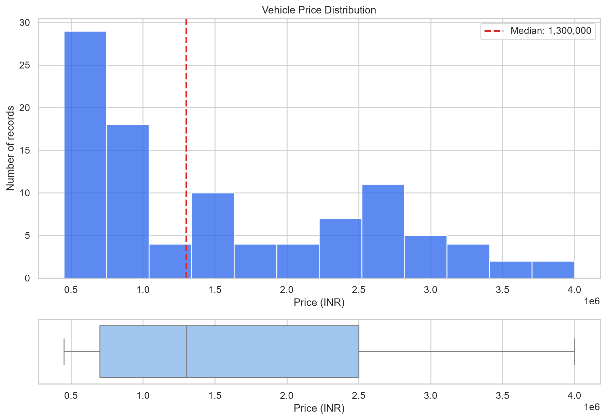
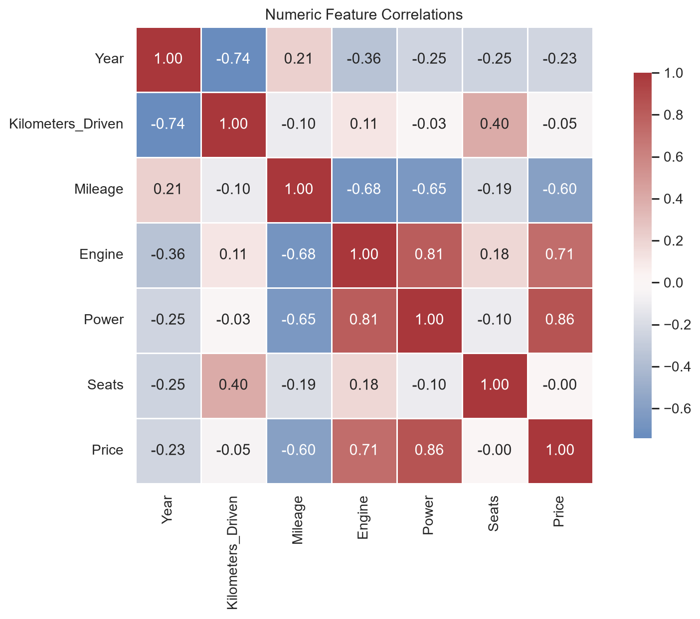
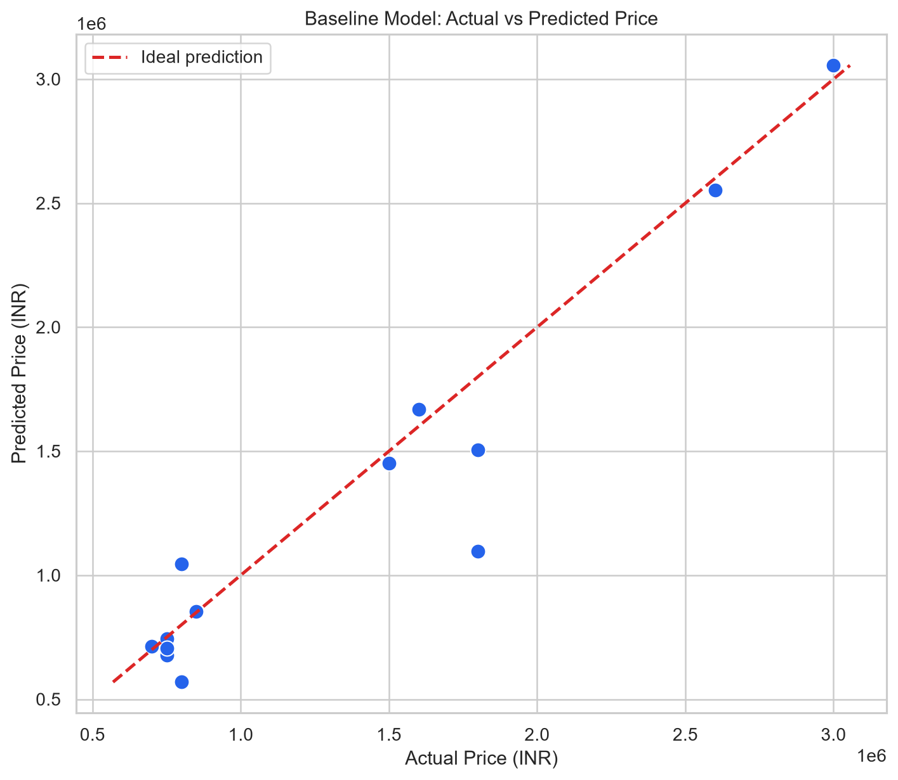

# Cars Dataset Analysis

An exploratory data analysis project with a small, reproducible Linear Regression baseline for automotive price estimation.

## Project Status

Portfolio-ready educational project. The notebook runs top-to-bottom, saves three analysis figures, and records the executed outputs used in this README.

## Overview

The project primarily explores, validates, and visualizes a small automotive dataset. It also includes a scikit-learn Linear Regression experiment to examine basic car-price estimation in a controlled notebook workflow.

The implementation emphasizes:

- explicit data-quality checks;
- portable repository paths;
- duplicate-leakage prevention before modeling;
- train-only preprocessing through a scikit-learn pipeline;
- deterministic splitting with `random_state=42`; and
- cautious interpretation of a small educational sample.

[Watch the project walkthrough on YouTube](https://www.youtube.com/watch?v=3O3N9WXuUNw)

## Dataset

The raw dataset contains **100 rows and 13 columns**. Each row describes a vehicle listing through:

- a unique record identifier (`Car_ID`);
- brand and model;
- production year and kilometers driven;
- fuel, transmission, and owner categories;
- mileage, engine capacity, power, and seats; and
- `Price`, the regression target.

The archived project materials document `Price` in **INR (Indian rupees)**. The repository includes a small educational automotive dataset originally used for coursework. The original external dataset URL was not preserved in the archive.

The raw CSV is kept unchanged. It has no missing values or fully identical rows. Because `Car_ID` is unique, a second check excludes that identifier and finds **39 repeated feature-target records**. The model uses one copy of each repeated profile, leaving **61 rows** before the train/test split.

## Workflow

1. Load the unchanged CSV through a repository-relative path.
2. Profile types, missingness, uniqueness, categories, and basic validity rules.
3. Inspect IQR flags without automatically deleting unusual observations.
4. Explore price distribution, numeric correlations, and brand-level summaries.
5. Remove `Car_ID` and repeated feature-target profiles from the modeling copy.
6. Split the data once into 48 training rows and 13 test rows.
7. Standardize numeric features and one-hot encode categorical features inside a `ColumnTransformer`.
8. Fit a `LinearRegression` baseline through a scikit-learn `Pipeline`.
9. Evaluate held-out predictions with MAE, RMSE, and R².

## Selected Visuals

### Price distribution



### Numeric correlations



### Baseline model results



## Model Results

The baseline was evaluated on the 13-row held-out test set.

| Metric | Result |
| --- | ---: |
| MAE | 141,360 INR |
| RMSE | 234,404 INR |
| R² | 0.900 |

These metrics describe one deterministic split of a very small dataset. They are useful for demonstrating the workflow, not for claiming production-grade predictive performance.

## Key Findings

- Median price is **1,300,000 INR**, while the mean is **1,574,000 INR**, indicating a right-skewed sample.
- `Power` has the strongest positive numeric correlation with price (**r = 0.86**).
- `Engine` also has a strong positive relationship with price (**r = 0.71**).
- `Mileage` has a moderate negative relationship with price (**r = -0.60**).
- BMW has the highest mean price in this sample at **3,030,000 INR across 10 records**.
- `Seats` is not constant, but its IQR is zero because both quartiles equal 5. The notebook therefore avoids blind IQR-based row removal.

These are descriptive findings from the available sample and do not establish causal relationships.

## Repository Structure

```text
.
├── data/
│   └── cars.csv
├── docs/
│   └── figures/
│       ├── correlation-heatmap.png
│       ├── model-results.png
│       └── price-distribution.png
├── notebooks/
│   └── cars-dataset-analysis.ipynb
├── .gitignore
├── README.md
└── requirements.txt
```

## Run Locally

```bash
git clone https://github.com/UAJOP/Cars-Dataset-Analysis.git
cd Cars-Dataset-Analysis
python -m venv .venv
```

Activate the environment:

```powershell
# Windows PowerShell
.\.venv\Scripts\Activate.ps1
```

```bash
# macOS or Linux
source .venv/bin/activate
```

Install the dependencies and execute the notebook:

```bash
python -m pip install -r requirements.txt
python -m jupyter nbconvert --to notebook --execute notebooks/cars-dataset-analysis.ipynb --inplace --ExecutePreprocessor.timeout=300
```

The same notebook also resolves `data/cars.csv` correctly when launched from the `notebooks/` directory.

## Limitations

- The sample contains only 100 raw rows and 61 unique feature-target profiles after conservative deduplication.
- The original external dataset URL and dataset license were not preserved in the repository archive.
- `Model` is high-cardinality relative to the sample size, so fitted coefficients and test performance may be unstable.
- A single train/test split is not a substitute for broader validation.
- The analysis is observational; correlations and coefficients are not causal effects.
- The Linear Regression result is an educational baseline, not a deployed model, AI prediction engine, or real vehicle valuation service.

## Portfolio

See the [Cars Dataset Analysis project page](https://kaanbalci.com/project-detail.html?project=cars-dataset-analysis) for the portfolio presentation.
